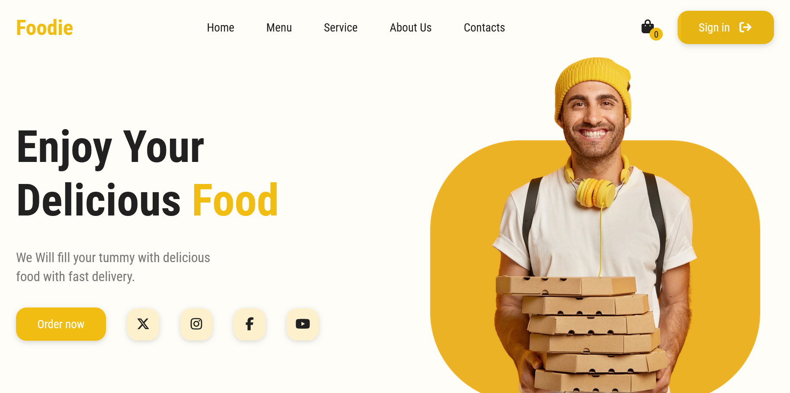

# 🍔 Foodie Website - Food Ordering UI

A modern responsive Food Ordering website built using **HTML, CSS, JavaScript**.  
Includes cart system, product listing, swiper reviews, and beautiful UI.

---

## 🚀 Live Demo
👉 https://vikaspawar-dev.github.io/foodie-website/

---

## 📸 Screenshot

---

## ✨ Features

- 🛒 Add to Cart System
- ➕➖ Quantity Update
- 📱 Fully Responsive Design
- 🎨 Modern UI Design
- 🔥 Swiper Reviews Slider
- ⚡ Fast and Lightweight

---

## 🛠️ Tech Stack

- HTML5
- CSS3
- JavaScript (Vanilla)
- Swiper JS
- Font Awesome

---

## 📂 Project Structure
images/
main.js
style.css
index.html
products.json

---

## 👨‍💻 Author

**Vikas Pawar**

- GitHub: https://github.com/vikaspawar-dev  
- LinkedIn: https://www.linkedin.com/in/vikas-pawar-74468a183

---

## ⭐ Show some support

If you like this project, please ⭐ star the repository.
